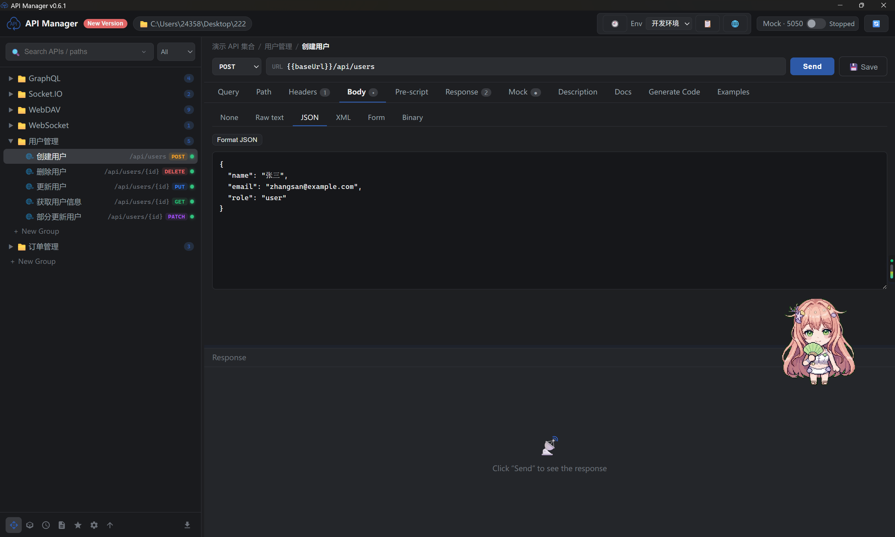
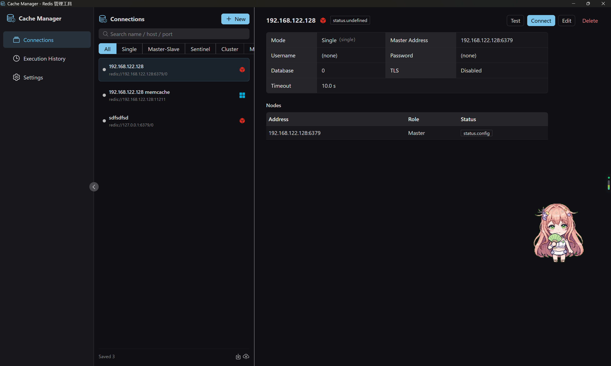
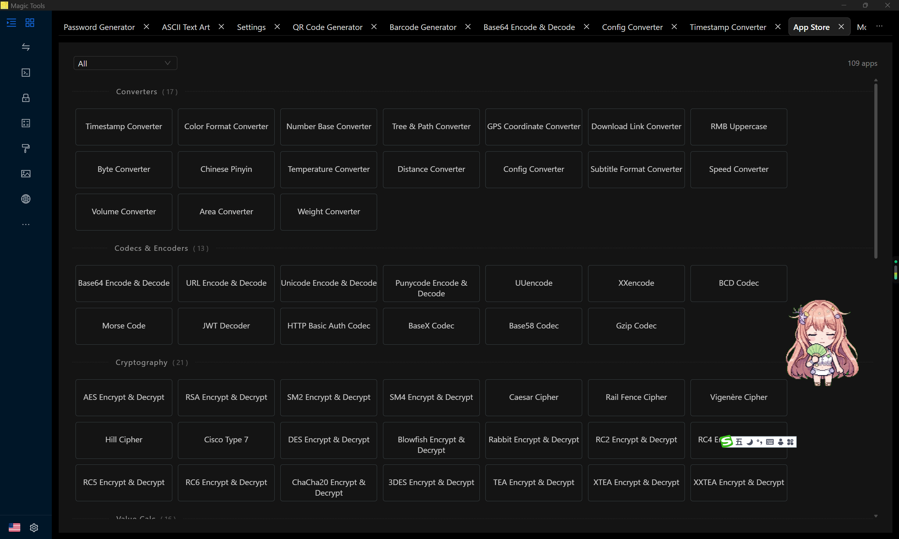
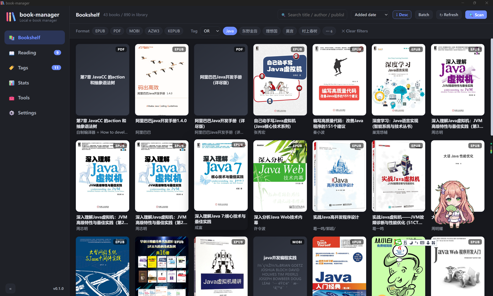

### 个人介绍 
```
	19年项目开发经验,可快速掌握各种语言应用于项目开发中
	熟悉带领团队进行工作,根据成员不同的能力和兴趣给予不同的任务分配和职业成长
	熟悉在 *nix 环境下进行相关开发
	能快速理解需求,并完成相关的系统设计和架构
```

> 求一份支持完全 Remote 或者 半 Remote 的 Full Stack 或 FDE 工作机会

### 掌握技能

```
	PHP        ★★★★★ 19年 项目架构能力 & 框架定制 & 扩展开发
	Javascript ★★★★✰ 19年 Vue / React / Electron 项目开发能力
	Python     ★★★★✰ 11年 项目架构能力 & 框架开发能力 
	Golang     ★★★★✰ 9年 项目架构能力 & 框架开发能力 
	Java       ★★★✰✰ 9年 基于 SpringBoot 的项目架构 & 基于 SpringCloud 的项目开发
	Rust       ★★✰✰✰ 3年 项目架构能力
```

### Contributions In The last year
  

### 项目汇总
<table border="0">
	<tbody>
		<tr>
			<td></td>
			<td></td>
		</tr>
		<tr>
			<td><a href="https://freewu.github.io/api-manager/">api-manager</a></td>
			<td><a href="https://freewu.github.io/cache-manager/">cache-manager</a></td>
		</tr>
		<tr>
			<td>使用 Tuari2 + React + Vite 开发的 HTTP / GraphQL / Websocket / Socket.IO 等类型接口文档 / 测试 / Mock 跨平台应用</td>
			<td>使用 Tuari2 + Vue3 + Vite 开发的 Redis / Memcache 跨平台客户端应用</td>
		</tr>
		<tr>
			<td></td>
			<td></td>
		</tr>
		<tr>
			<td><a href="https://freewu.github.io/magic-tools/">magic-tools</a></td>
			<td><a href="https://freewu.github.io/book-manager/">book-manager</a></td>
		</tr>
		<tr>
			<td>使用 Tuari2 + AntDesign 开发的工具集 跨平台应用</td>
			<td>使用 Wails v2 + React + Vite 开发的本地电子书跨平台客户端应用</td>
		</tr>
	</tbody>
</table>
